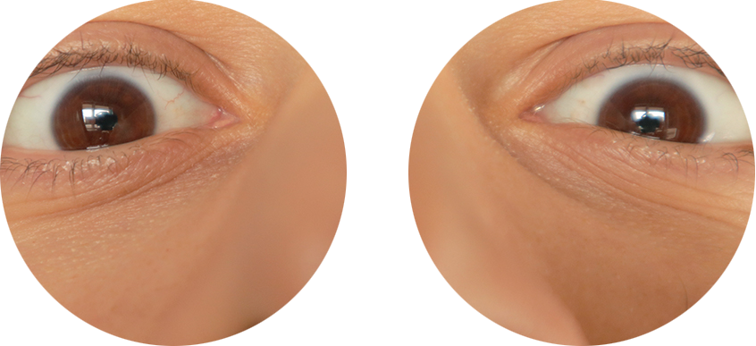

#  👋 Nice to SEE you!

The most successful individuals are those who have experienced the greatest number of failures. Does that imply that in order to succeed, you must fail a lot? If you believe this, you are erroneous; it is a cognitive bias caused by linguistic manipulations. For those who are interested in such themes, I will shortly be starting a new initiative to assist you in developing your critical thinking skills.

Don't worry, friend, if you get lost and there aren't enough people around to help you with your code. Those nice, kind eyes will bring you through the darkness of HR's mind to the correct hiring choice.

<h3>My main stack</h3>

   
  
  
  
  

 

# 💬 Blog posts
<!-- BLOG-POST-LIST:START -->
- [Breaking the Code: How Continuous Integration and Deployment Make You Unstoppable!](http://badalloff.science/en/articles/54)
- [JavaScript&#39;s Asynchronous Power: Promises and Async/Awaito translation... yet!](http://badalloff.science/en/articles/53)
- [The Ruby Object Model by Dave Thomas](http://badalloff.science/en/articles/52)
- [Ruby is Back! All hail Ruby! - programming language rating TIOBE](http://badalloff.science/en/articles/51)
- [SOLID - Simply about D - Dependency Inversion Principle](http://badalloff.science/en/articles/50)
<!-- BLOG-POST-LIST:END -->

<h3>Things I had experience with.</h3>

  
   
  
  
  
  
  
  
  
  
  
  
  
  
  
  
  
  
  
  
  
  
  
  
  
  
  
  
  
  
  
  
  
  
  
  
  
  
  
  
    

<!--
**BadAllOff/BadAllOff** is a ✨ _special_ ✨ repository because its `README.md` (this file) appears on your GitHub profile.

Here are some ideas to get you started:

- 🔭 I’m currently working on ...
- 🌱 I’m currently learning ...
- 👯 I’m looking to collaborate on ...
- 🤔 I’m looking for help with ...
- 💬 Ask me about ...
- 📫 How to reach me: ...
- 😄 Pronouns: ...
- ⚡ Fun fact: ...
-->
